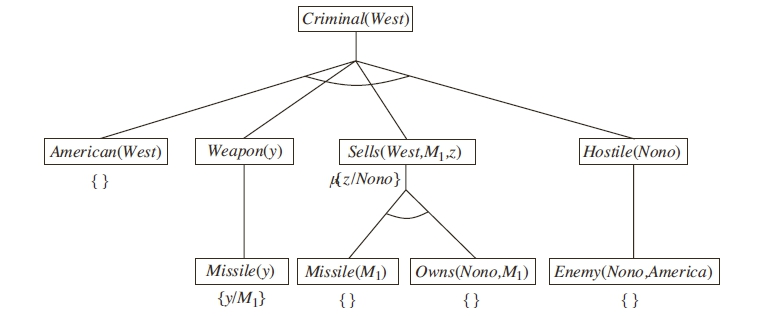

# Backward-chaining demo


The proof tree that should be constructed by backward-chaining.

## Prospective inference path

To prove the consequence of the following ImplicationLink, substitutions for
all its variables need to be found:
```
(ImplicationLink
    (AndLink
        (InheritanceLink
            (VariableNode "$x")
            (ConceptNode "American"))
        (InheritanceLink
            (VariableNode "$y")
            (ConceptNode "weapon"))
        (EvaluationLink
            (PredicateNode "sell")
            (ListLink
                (VariableNode "$x")
                (VariableNode "$y")
                (VariableNode "$z")))
        (InheritanceLink
            (VariableNode "$z")
            (ConceptNode "hostile")))
    (InheritanceLink
        (VariableNode "$x")
        (ConceptNode "criminal")))
```

### First condition
Backward-chaining should bind "$x" to "West"

### Second condition
Backward-chaining should bind "$y" to "missile@123"

### Third condition
Backward-chaining should bin "$z" to "Nono"
            
## Current inference path

The current inference path looks like this:
```
----- [Output # 1] -----
-- Output:
(InheritanceLink (stv 0.982100 0.990000)
  (VariableNode "$b") ; [36]
  (ConceptNode "hostile") ; [11]
) ; [40]

-- using production rule: ModusPonensRule<ImplicationLink>
-- after 6 inferences attempted so far

-- based on this input:
[(ImplicationLink (av 0 0 0) (stv 0.990000 0.990000)
  (EvaluationLink (av 0 0 0) (stv 1.000000 0.000000)
    (PredicateNode "enemy_of" (av 0 0 0) (stv 1.000000 0.000000)) ; [35]
    (ListLink (av 0 0 0) (stv 1.000000 0.000000)
      (VariableNode "$b" (av 0 0 0) (stv 1.000000 0.000000)) ; [36]
      (ConceptNode "America" (av 0 0 0) (stv 1.000000 0.000000)) ; [37]
    ) ; [38]
  ) ; [39]
  (InheritanceLink (av 0 0 0) (stv 0.982100 0.990000)
    (VariableNode "$b" (av 0 0 0) (stv 1.000000 0.000000)) ; [36]
    (ConceptNode "hostile" (av 0 0 0) (stv 1.000000 0.000000)) ; [11]
  ) ; [40]
) ; [41]
, (EvaluationLink (av 0 0 0) (stv 0.990000 0.990000)
  (PredicateNode "enemy_of" (av 0 0 0) (stv 1.000000 0.000000)) ; [35]
  (ListLink (av 0 0 0) (stv 1.000000 0.000000)
    (ConceptNode "Nono" (av 0 0 0) (stv 1.000000 0.000000)) ; [21]
    (ConceptNode "America" (av 0 0 0) (stv 1.000000 0.000000)) ; [37]
  ) ; [43]
) ; [44]
]

----- [Output # 2] -----
-- Output:
(EvaluationLink (stv 0.982100 0.990000)
  (PredicateNode "sell") ; [7]
  (ListLink (stv 1.000000 0.000000)
    (ConceptNode "West") ; [30]
    (VariableNode "$a") ; [25]
    (ConceptNode "Nono") ; [21]
  ) ; [31]
) ; [32]

-- using production rule: ModusPonensRule<ImplicationLink>
-- after 32 inferences attempted so far

-- based on this input:
[(ImplicationLink (av 0 0 0) (stv 0.990000 0.990000)
  (AndLink (av 0 0 0) (stv 1.000000 0.000000)
    (InheritanceLink (av 0 0 0) (stv 1.000000 0.000000)
      (VariableNode "$a" (av 0 0 0) (stv 1.000000 0.000000)) ; [25]
      (ConceptNode "missile" (av 0 0 0) (stv 1.000000 0.000000)) ; [18]
    ) ; [26]
    (EvaluationLink (av 0 0 0) (stv 1.000000 0.000000)
      (PredicateNode "own" (av 0 0 0) (stv 1.000000 0.000000)) ; [20]
      (ListLink (av 0 0 0) (stv 1.000000 0.000000)
        (ConceptNode "Nono" (av 0 0 0) (stv 1.000000 0.000000)) ; [21]
        (VariableNode "$a" (av 0 0 0) (stv 1.000000 0.000000)) ; [25]
      ) ; [27]
    ) ; [28]
  ) ; [29]
  (EvaluationLink (av 0 0 0) (stv 0.982100 0.990000)
    (PredicateNode "sell" (av 0 0 0) (stv 1.000000 0.000000)) ; [7]
    (ListLink (av 0 0 0) (stv 1.000000 0.000000)
      (ConceptNode "West" (av 0 0 0) (stv 1.000000 0.000000)) ; [30]
      (VariableNode "$a" (av 0 0 0) (stv 1.000000 0.000000)) ; [25]
      (ConceptNode "Nono" (av 0 0 0) (stv 1.000000 0.000000)) ; [21]
    ) ; [31]
  ) ; [32]
) ; [33]
, (AndLink (av 0 0 0) (stv 0.990000 0.990000)
  (InheritanceLink (av 0 0 0) (stv 0.990000 0.990000)
    (ConceptNode "missile@123" (av 0 0 0) (stv 1.000000 0.000000)) ; [17]
    (ConceptNode "missile" (av 0 0 0) (stv 1.000000 0.000000)) ; [18]
  ) ; [19]
  (EvaluationLink (av 0 0 0) (stv 0.990000 0.990000)
    (PredicateNode "own" (av 0 0 0) (stv 1.000000 0.000000)) ; [20]
    (ListLink (av 0 0 0) (stv 1.000000 0.000000)
      (ConceptNode "Nono" (av 0 0 0) (stv 1.000000 0.000000)) ; [21]
      (ConceptNode "missile@123" (av 0 0 0) (stv 1.000000 0.000000)) ; [17]
    ) ; [22]
  ) ; [23]
) ; [24]
]

----- [Output # 3] -----
-- Output:
(InheritanceLink (stv 0.982100 0.990000)
  (ConceptNode "Nono") ; [21]
  (ConceptNode "hostile") ; [11]
) ; [372]

-- using production rule: ModusPonensRule<ImplicationLink>
-- after 58 inferences attempted so far

-- based on this input:
[(ImplicationLink (av 0 0 0) (stv 0.990000 0.990000)
  (EvaluationLink (av 0 0 0) (stv 1.000000 0.000000)
    (PredicateNode "enemy_of" (av 0 0 0) (stv 1.000000 0.000000)) ; [35]
    (ListLink (av 0 0 0) (stv 1.000000 0.000000)
      (VariableNode "$b" (av 0 0 0) (stv 1.000000 0.000000)) ; [36]
      (ConceptNode "America" (av 0 0 0) (stv 1.000000 0.000000)) ; [37]
    ) ; [38]
  ) ; [39]
  (InheritanceLink (av 0 0 0) (stv 0.982100 0.990000)
    (VariableNode "$b" (av 0 0 0) (stv 1.000000 0.000000)) ; [36]
    (ConceptNode "hostile" (av 0 0 0) (stv 1.000000 0.000000)) ; [11]
  ) ; [40]
) ; [41]
, (EvaluationLink (av 0 0 0) (stv 0.990000 0.990000)
  (PredicateNode "enemy_of" (av 0 0 0) (stv 1.000000 0.000000)) ; [35]
  (ListLink (av 0 0 0) (stv 1.000000 0.000000)
    (ConceptNode "Nono" (av 0 0 0) (stv 1.000000 0.000000)) ; [21]
    (ConceptNode "America" (av 0 0 0) (stv 1.000000 0.000000)) ; [37]
  ) ; [43]
) ; [44]
]

----- [Output # 4] -----
-- Output:
(EvaluationLink (stv 0.982100 0.990000)
  (PredicateNode "sell") ; [7]
  (ListLink (stv 1.000000 0.000000)
    (ConceptNode "West") ; [30]
    (ConceptNode "missile@123") ; [17]
    (ConceptNode "Nono") ; [21]
  ) ; [523]
) ; [524]

-- using production rule: ModusPonensRule<ImplicationLink>
-- after 87 inferences attempted so far

-- based on this input:
[(ImplicationLink (av 0 0 0) (stv 0.990000 0.990000)
  (AndLink (av 0 0 0) (stv 1.000000 0.000000)
    (InheritanceLink (av 0 0 0) (stv 1.000000 0.000000)
      (VariableNode "$a" (av 0 0 0) (stv 1.000000 0.000000)) ; [25]
      (ConceptNode "missile" (av 0 0 0) (stv 1.000000 0.000000)) ; [18]
    ) ; [26]
    (EvaluationLink (av 0 0 0) (stv 1.000000 0.000000)
      (PredicateNode "own" (av 0 0 0) (stv 1.000000 0.000000)) ; [20]
      (ListLink (av 0 0 0) (stv 1.000000 0.000000)
        (ConceptNode "Nono" (av 0 0 0) (stv 1.000000 0.000000)) ; [21]
        (VariableNode "$a" (av 0 0 0) (stv 1.000000 0.000000)) ; [25]
      ) ; [27]
    ) ; [28]
  ) ; [29]
  (EvaluationLink (av 0 0 0) (stv 0.982100 0.990000)
    (PredicateNode "sell" (av 0 0 0) (stv 1.000000 0.000000)) ; [7]
    (ListLink (av 0 0 0) (stv 1.000000 0.000000)
      (ConceptNode "West" (av 0 0 0) (stv 1.000000 0.000000)) ; [30]
      (VariableNode "$a" (av 0 0 0) (stv 1.000000 0.000000)) ; [25]
      (ConceptNode "Nono" (av 0 0 0) (stv 1.000000 0.000000)) ; [21]
    ) ; [31]
  ) ; [32]
) ; [33]
, (AndLink (av 0 0 0) (stv 0.990000 0.990000)
  (InheritanceLink (av 0 0 0) (stv 0.990000 0.990000)
    (ConceptNode "missile@123" (av 0 0 0) (stv 1.000000 0.000000)) ; [17]
    (ConceptNode "missile" (av 0 0 0) (stv 1.000000 0.000000)) ; [18]
  ) ; [19]
  (EvaluationLink (av 0 0 0) (stv 0.990000 0.990000)
    (PredicateNode "own" (av 0 0 0) (stv 1.000000 0.000000)) ; [20]
    (ListLink (av 0 0 0) (stv 1.000000 0.000000)
      (ConceptNode "Nono" (av 0 0 0) (stv 1.000000 0.000000)) ; [21]
      (ConceptNode "missile@123" (av 0 0 0) (stv 1.000000 0.000000)) ; [17]
    ) ; [22]
  ) ; [23]
) ; [24]
]

Suspect found guilty! West is a criminal! The following incriminating evidence proves it:
(InheritanceLink (stv 1.000000 0.000000)
  (ConceptNode "West") ; [30]
  (ConceptNode "criminal") ; [14]
) ; [644]

---- Answer found after 4 inference steps that produced a new output, out of 109 total inference steps attempted.
```

As can be seen, the necessary substitutions are produced, but they are not yet
inserted into the final ImplicationLink. Still, the final inference is produced.
However, this only happens after 22 additional inference steps after the last rule output.
In these inference steps, no output is displayed and still the conclusion is reached.

Investigation of the final atomspace contents surfaces that
```
(InheritanceLink (stv 1.000000 0.000000)
    (VariableNode "$x") ; [1]
    (ConceptNode "criminal") ; [14]
) ; [15]
```
erroneously substitutes both "$a" and "$y" in the respective links:
```
(InheritanceLink (stv 1.000000 0.000000)
  (InheritanceLink (stv 1.000000 0.000000)
    (VariableNode "$x") ; [1]
    (ConceptNode "criminal") ; [14]
  ) ; [15]
  (ConceptNode "weapon") ; [5]
) ; [110]
(InheritanceLink (stv 1.000000 0.000000)
  (InheritanceLink (stv 1.000000 0.000000)
    (VariableNode "$x") ; [1]
    (ConceptNode "criminal") ; [14]
  ) ; [15]
  (ConceptNode "missile") ; [18]
) ; [648]
(EvaluationLink (stv 1.000000 0.000000)
  (PredicateNode "sell") ; [7]
  (ListLink (stv 1.000000 0.000000)
    (VariableNode "$x") ; [1]
    (InheritanceLink (stv 1.000000 0.000000)
      (VariableNode "$x") ; [1]
      (ConceptNode "criminal") ; [14]
    ) ; [15]
    (VariableNode "$z") ; [8]
  ) ; [111]
) ; [112]
```
which lets "West" bind to "$x" and thus prematurely produces the desired inference:
```
(EvaluationLink (stv 1.000000 0.000000)
  (PredicateNode "sell") ; [7]
  (ListLink (stv 1.000000 0.000000)
    (ConceptNode "West") ; [30]
    (InheritanceLink (stv 1.000000 0.000000)
      (ConceptNode "West") ; [30]
      (ConceptNode "criminal") ; [14]
    ) ; [644]
    (ConceptNode "Nono") ; [21]
  ) ; [645]
) ; [646]
```
This needs to be debugged.
