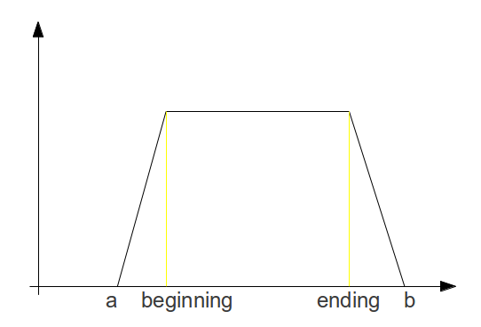

# Uncertain Interval Algebra via Fuzzy/Probabilistic Modeling

_Note_: For the discussion, refer to [this mailing list thread](https://groups.google.com/forum/#!searchin/opencog/allen$27s$20interval$20algebra/opencog/iwAB1ofwTqc/8At9rRBJR3IJ).

The current implementation of temporal reasoning that is intended to be used
by PLN uses a fuzzy version of __Allen's Interval Algebra__ (IA). IA defines
thirteen basic relations between time intervals that are distinct, exhaustive,
and qualitative. The relations and the operations that can be performed on them
can be viewed [here](http://www.ics.uci.edu/~alspaugh/cls/shr/allen.html).

IA uses exact points-in-time for crisp reasoning and is not designed to handle
uncertainty (as the probability of a point-in-time is 0 in a probability
distribution).

The current approach extends an _interval_ to an _event_: While an Allen
_interval_ is one-dimensional, an _event_ has two dimensions, time and
certainty. The event is modeled as a trapezium which can be considered as
divided into beginning, middle and ending stages with the beginning and ending
distributions being linear and disjoint.



Intuitively, the event starts to happen at _a_ and our confidence about its
happening increases linearly up to time-step _beginning_. At this point, we're
completely sure that the event is happening and continue to be until the
_ending_ time-step. Here, our confidence starts to decrease gradually until 
the time-step _b_ where it reaches 0 and we are sure that the event has ended.

In order to handle the IA interval relations in this formalism, three functions
are defined between distributions that can either be the beginning or the
ending distribution of an interval:

```
before(dist1,dist2)
same(dist1,dist2)
after(dist1,dist2)
```

The degree of the _{s}_ starts relation between two intervals A and B can be
computed as:

```
same(dist_beg(A),dist_beg(B)) * before(dist_beg(A),dist_end(B))*
after(dist_(end(A),dist_beg(B)) * before(dist_end(A),dist_end(B))
```

meaning the degree of the beginning distribution of A being the same as the
beginning distribution of B, times the degree of the beginning distribution of A
being before the ending distribution of B, etc.

## Implementation

### The time definition

The system uses UnixTime as specified [here](unix_time.py) to measure time.
Unix time is defined as the number of seconds that have elapsed since 00:00:00
Coordinated Universal Time (UTC), Thursday, 1 January 1970, not counting leap
seconds.

### The trapezium

The basic unit of the implementation is the TemporalEventTrapezium (specified
[here](temporal_events/trapezium.py)) which inherits from [TemporalEvent](temporal_events/__init__.py).

A TemporalEventTrapezium is instantiated by providing it with the four
parameters that were specified above: a, b, beginning, and ending. Two intervals
are instantiated as follows:

```
A = TemporalEventTrapezium(1, 12, 4, 8)
B = TemporalEventTrapezium(9, 17, 13, 15)
```

If only a and b are provided as parameters, beginning and ending are generated
randomly.

### From events to relations

To compute the relations between two intervals A and B, TemporalRelation
overrideds the ```__mult__``` operator. The relations between the two intervals
can thus be calculated simply by multiplying them:

```
temporal_relations = A * B
```

The result is a [TemporalRelation](temporal_events/relation_formulas.py), a
dictionary that has the abbrevations for the [thirteen basic relations](http://www.ics.uci.edu/~alspaugh/cls/shr/allen.html#Thirteen_basic_relations)
as key and the computed degrees as values.

The dictionary can be viewed by running ```temporal_relations.to_list()``` or
by looping over the thirteen relations:

```
for relation in "pmoFDseSdfOMP":
    print(relation, temporal_relations[relation])
```

which yields the following values:

```
('p', 0.71875)
('m', 0.5625)
('o', 0.28125)
('F', 0.0)
('D', 0.0)
('s', 0.0)
('e', 0.0)
('S', 0.0)
('d', 0.0)
('f', 0.0)
('O', 0.0)
('M', 0.0)
('P', 0.0)
```

### From relations to before, same, and after (and back to events)

If one knows the 13 relations that exist between two intervals, one can compute
the before, same, and after relationships that exist between their beginning and
ending distributions.

In order to do this, one passes the ```temporal_relations``` as defined above
to the [DecompositionFitter](temporal_events/composition/non_linear_least_squares.py).
The DecompositionFitter instantiates the before, same, and after relationships
between the beginning and ending distributions of the two intervals with initial
values. It then learns the correct values for the parameters using
[lmfit.minimizer.minimize](http://cars9.uchicago.edu/software/python/lmfit/fitting.html#minimize)
together with a fitness function. To calculate from the before, same, and after
relationships the initial 13 Allen interval relations, one passes the
DecompositionFitter to FormulaCreator defined [here](temporal_events/relation_formulas.py)
and calls ```calculate_relations()```:

```
temporal_relations = FormulaCreator(DecompositionFitter(relations)).calculate_relations()
```

### Composition

In order to perform composition, i.e. to calculate the relations that hold
between events A and C if the relations between events A and B and between B
and C are known, one passes the relations between A and B and between B and C
again to the DecompositionFitter to be subsequently able to retrieve the
before, same, and after relationships holding between these events.

```
relation_a_b = DecompositionFitter(relations_a_b)
relation_b_c = DecompositionFitter(relations_b_c)
```

DepthFirstSearchComposition defined [here](temporal_events/composition/depth_first_search_composition.py)
works with these before, same, and after relationships to calculate the relations
holding between A and C.

An example of a composition can be found [here](temporal_events/composition/__init__.py).

An initial, simple demo can be viewed [here](demo.py).

Further explanations and a more comprehensive demo are under way.
